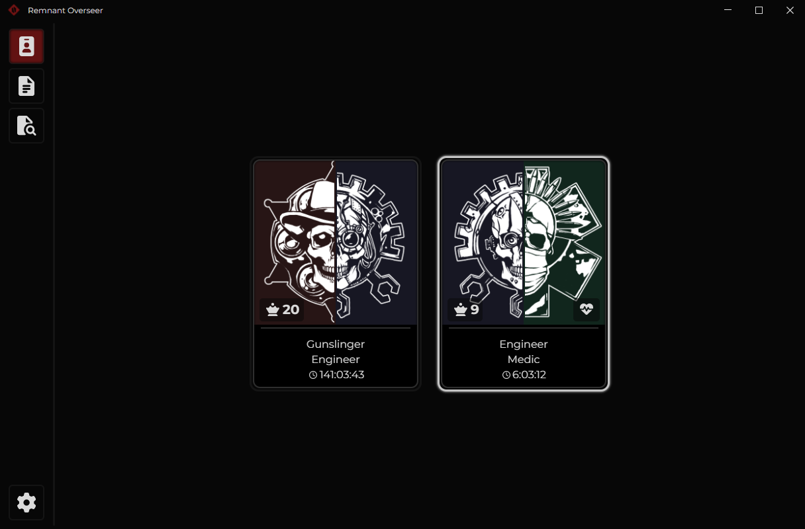
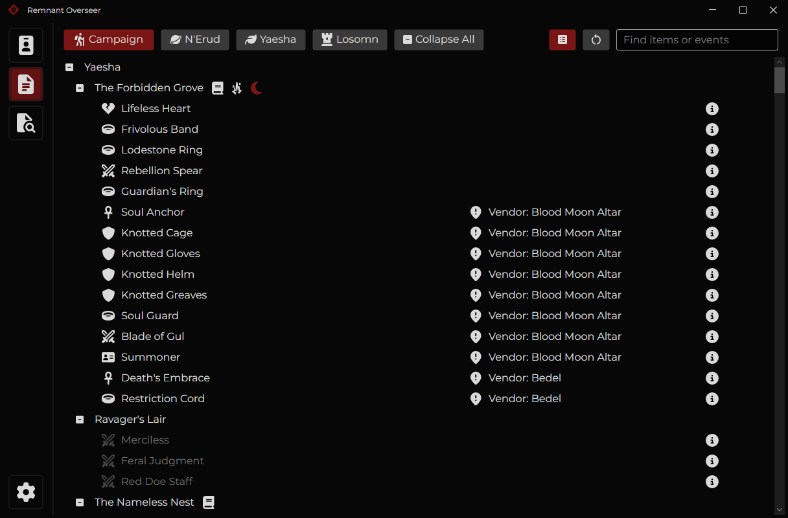

#  Remnant Overseer

A companion tool for **Remnant 2** that allows you to view the information about your current save.<br/>
Select your character and see which items they are missing and which ones you can get in your currently rolled worlds.

This tool only **reads** the save file, it can not make any changes to it.

# Screenshots
<p float="left">
  
   
</p>

# Features
- Displays the items that are available in the current rolled world
- Displays the current location of the player
- Indicates whether Trait book and/or Simulacrum are available in the location
- ~~Displays Bloodmoon status~~ Temporarily doesn't
- Displays whether an item is only obtainable in co-op
- Allows to filter by item names and injectable events
- Updates the state whenever the save file changes
- Gamepass support
- ... and more?

# Installation
- Download and install [.NET 8.0](https://dotnet.microsoft.com/en-us/download/dotnet/8.0) or greater
  - You only need a .NET Desktop Runtime x64, but you can install the whole SDK if you want to
- Download the latest release
- Unpack the archive to a folder. To avoid issues, use a non-system folder, such as `C:\Games\RemnantOverseer`
- Launch the .exe file
- If playing on steam, it should autodetect your save. If playing from Xbox/Gamepass, check the "Finding your save" section below.

# Acknowledgements
- Razzmatazzz for his [project](https://github.com/Razzmatazzz/RemnantSaveGuardian), which served as an inspiration for this one and made me look into working on Remnant in the first place
- AndrewSav for [https://github.com/AndrewSav/lib.remnant2.analyzer](https://github.com/AndrewSav/lib.remnant2.analyzer), which is used as an underlying parsing library
- Avalonia (EN) telegram channel and specifically Steve for answering many of my AvaloniaUI-related questions
- And you! For taking an interest in the project

# Known issues
- When viewing a big list of items application is stuttering on refresh. This is due to my control of choice (treeview) not having virtualization, so building a visual tree takes a while. I learned about this quite late in development, so I decided to stick with it for now. I will try to optimize it when I have extra time (this will require a non-trivial rework)

# Finding your save
- If playing on the Xbox/Gamepass release of the game, you'll need to go into settings and update your save file location.
- This is typically found in:
```
C:\Users\[YourUser]\AppData\Local\Packages\PerfectWorldEntertainment.GFREMP2_jrajkyc4tsa6w\SystemAppData\wgs
```
- In that folder, there should be a folder named `t` and then a folder with a long ID for the name, open THAT folder
- Inside the [SomeLongID] folder, there should be a `containers.index` file, that's the save you're looking for.

If that doesn't work, you can search your game drive for `containers.index` and find the one for this game. (The path should include `PerfectWorldEntertainment.GFREMP2`)
